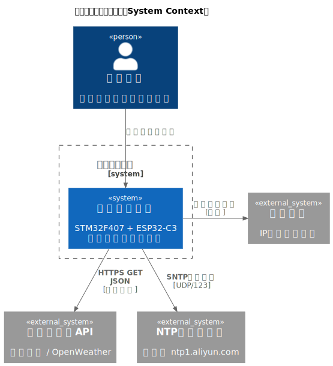
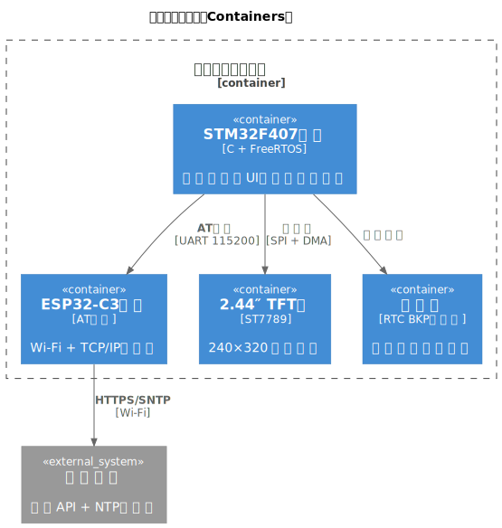
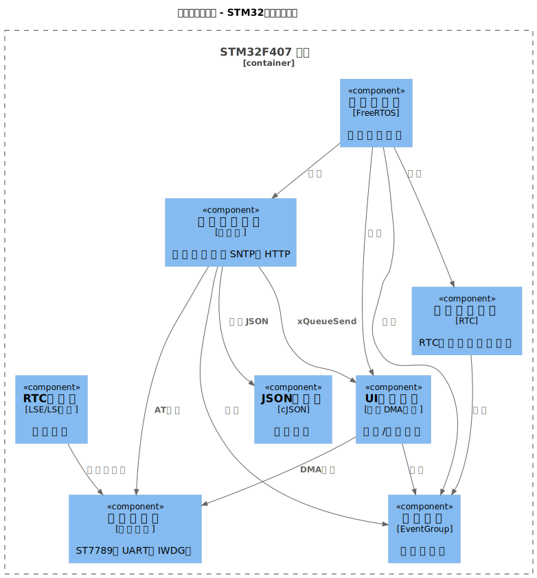
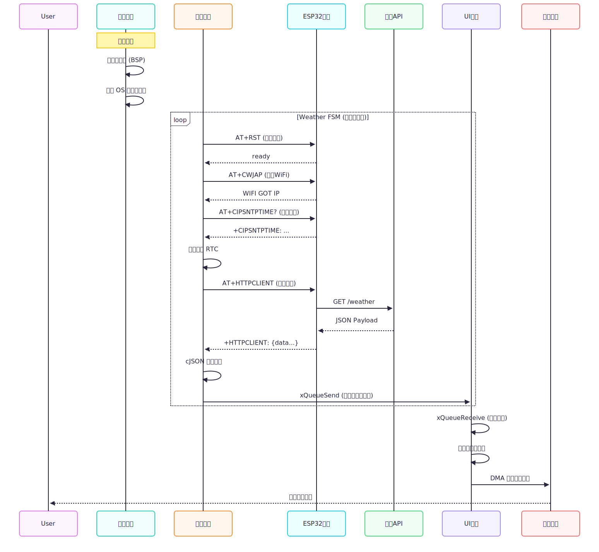
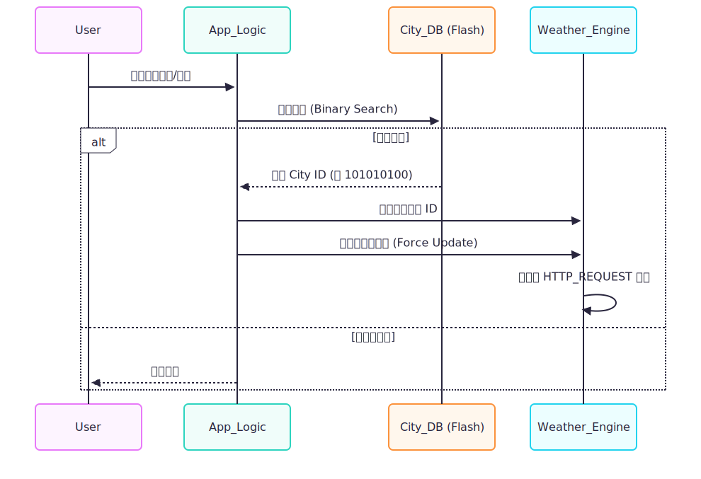

# 天气时钟 (Weather Clock) 项目架构文档

## 1. 文档信息
- **项目名称**：天气时钟 (Weather Clock)
- **文档版本**：v2.0
- **编写人员**：meng-ming
- **编写日期**：2025-12-09

## 2. 修订历史
| 版本 | 日期       | 修改人    | 修订内容                                                                 |
|------|------------|-----------|--------------------------------------------------------------------------|
| v1.0 | 2025-12-09 | meng-ming | 初始版本发布。基于 FreeRTOS 重构系统架构，定义核心模块与通信协议。     |
| v2.0 | 2025-12-09 | meng-ming | 增加 DMA 分块传输机制、LSI 自动校准方案及 FreeRTOS 任务通知机制说明。   |

## 3. 项目概述
### 3.1 核心功能清单
| 优先级 | 功能模块 | 详细描述                                                             |
|--------|----------|----------------------------------------------------------------------|
| P0     | 精准授时 | 本地 RTC + NTP 网络校时双重保障，支持 LSE/LSI 故障自愈及自动频率校准。 |
| P0     | 实时天气 | 基于位置的实时天气获取，支持天气图标可视化展示。                     |
| P0     | 高刷 UI  | 基于 DMA 的高性能 UI 渲染引擎，支持 240x320 分辨率流畅刷新。         |
| P1     | 城市切换 | 支持全国主要城市代码检索与切换。                                     |
| P1     | 状态监控 | 实时监控 WiFi 连接状态、数据更新时间，具备异常状态可视化。           |

### 3.2 非功能性需求 (NFR)
- **稳定性**：系统需具备 7x24h 不间断运行能力，MTBF（平均故障间隔时间） > 5000 小时。
- **实时性**：UI 交互响应时间 < 100 ms，时钟走时日误差 < 1 s（网络校时后）。
- **资源约束**：RAM 占用 < 60 KB (CCM + SRAM)，Flash 占用 < 512 KB。
- **鲁棒性**：具备看门狗保护、任务栈溢出检测、外设硬件故障自动降级机制。

## 4. 系统架构图
### 4.1 系统上下文图 (C4 Context)

### 4.2 容器图 (C4 Container)

### 4.3 组件图 (C4 Component) - MCU 固件内部视角

## 5. 技术选型与版本
| 领域     | 技术/组件         | 版本     | 选型理由                                                                 |
|----------|-------------------|----------|--------------------------------------------------------------------------|
| Kernel   | FreeRTOS          | V10.6.2  | 行业标准 RTOS，支持抢占式调度，满足实时需求，生态完善（EventGroup、TaskNotify）。 |
| MCU      | STM32F407ZGT6     | -        | Cortex-M4F 内核，168 MHz 主频，192 KB SRAM，充分支持复杂 UI 与 JSON 解析。 |
| Language | C99               | -        | 嵌入式开发标准，兼顾性能与可移植性，GCC 编译器兼容性优秀。               |
| Build    | CMake + Ninja     | 3.20+    | 现代化构建系统，支持增量编译，与 VS Code 集成高效，便于 CI/CD 流程。    |
| Protocol | AT Commands       | ESP-AT   | 将 TCP/IP 协议栈卸载至 ESP32，减轻 MCU 负载，提升系统稳定性。           |
| UI       | Custom DMA Engine | v2.0     | 自研 DMA 传输引擎，比 LVGL 更轻量，针对 ST7789 优化，实现零 CPU 占用刷屏。 |
| Parser   | cJSON             | 1.7.15   | 超轻量级 JSON 解析器，内存占用可控，API 简洁高效。                      |

## 6. 核心模块划分与职责
| 模块名称                  | 核心文件                     | 职责边界                                                                                                                       | 对外接口 (API)                                   |
|---------------------------|------------------------------|--------------------------------------------------------------------------------------------------------------------------------|--------------------------------------------------|
| Weather Engine (天气引擎) | app_weather.c esp32_module.c | 1. 维护网络连接状态机 (Init -> WiFi -> SNTP -> HTTP)。 2. 负责故障检测与指数退避重试。 3. 协调 SNTP 时间同步。 | APP_Weather_Init() APP_Weather_Task() APP_Weather_Force_Update() |
| UI Controller (UI 控制器) | app_ui.c ui_main_page.c  | 1. 订阅天气数据队列。 2. 管理屏幕资源互斥锁。 3. 调度具体页面的绘制逻辑。                                      | APP_UI_Init() APP_UI_Update() APP_UI_ShowStatus() |
| RTC Guardian (RTC 守护者) | bsp_rtc.c                   | 1. LSE/LSI 时钟源仲裁与切换。 2. 利用 TIM5 捕获功能进行 LSI 频率自动校准。 3. 备份域复位与时间有效性检查。    | BSP_RTC_Init() BSP_RTC_GetCalendar() BSP_RTC_Is_Time_Invalid() |
| Display Driver (显示驱动) | st7789.c lcd_font.c      | 1. SPI + DMA 底层传输配置。 2. 处理 >65535 字节的分包传输。 3. 字符点阵到 RGB565 的颜色扩展。                 | TFT_Fill_Rect_DMA() TFT_ShowImage_DMA() LCD_Show_String() |
| System Daemon (系统守护)  | app_tasks.c bsp_iwdg.c   | 1. 喂独立看门狗 (IWDG)。 2. 监控所有业务任务的 EventGroup 打卡状态。 3. 监控堆栈水位。                       | -                                                |

## 7. 数据流与关键流程
### 7.1 系统启动与数据更新流程

### 7.2 RTC 故障自愈流程

### 7.3 城市切换流程

## 8. 数据持久化设计 (Data Persistence)
本项目作为嵌入式终端，受限于 Flash 寿命与 RAM 大小，采用“读写分离”的轻量级数据策略，确保高效存储与访问。

### 8.1 静态数据库 (Read-Only Database)
城市代码表数据量庞大（数千条），不适合运行时动态加载，采用编译时数据库 (Compile-time Database) 方案。

- **源数据**：Resources/City/src/cityid.sql
  （包含全国主要城市的 ID 与中文名称映射。）
- **构建工具**：Resources/City/src/sql2c_sorted.py
  （Python 脚本负责在编译前预处理 SQL 数据，按拼音/ID 排序。）
- **生成产物**：Resources/City/src/city_code.c
  （生成一个存储在 Flash (.rodata) 中的 const 结构体数组。）
- **查询算法**：
  由于数据已预排序，运行时采用二分查找法 (Binary Search)，时间复杂度为 O(log N)，确保在 MCU 上实现毫秒级检索。

### 8.2 运行时配置 (Runtime Config)
- **系统状态标记**：
  利用 STM32 RTC 的备份寄存器 RTC_BKP_DR0。
  机制：RTC_BKP_DR0 在 Vbat 供电下掉电不丢失。写入特定魔数 (Magic Number 0xA0A3) 用于标记“系统已初始化”或“LSE 故障复位”，防止热启动时重复执行耗时初始化。
- **业务数据缓存**：
  APP_Weather_Data_t 结构体驻留在 SRAM 中。
  作为天气数据的“快照”，避免每次 UI 刷新都重新解析 JSON，降低 CPU 负担。

## 9. 外部依赖与第三方服务 (External Dependencies)
| 类别       | 服务提供商          | 接口地址 / 参数                                | 对应代码文件                       |
|------------|---------------------|------------------------------------------------|------------------------------------|
| 天气数据   | 心知天气 (Seniverse) | api.seniverse.com (HTTP GET) API: /free/day (实况/3天预报) | app_weather.c weather_parser.c     |
| 时间同步   | 阿里云 NTP          | ntp1.aliyun.com (SNTP/UDP) 端口: 123          | esp32_module.c ESP_SNTP_Config()   |
| Wi-Fi 模组 | Espressif           | ESP32-C3 (AT Firmware v2.x+) 波特率: 115200   | esp32_module.c                     |
| 编译工具链 | ARM                 | arm-none-eabi-gcc 13.2.Rel1                    | CmakeLists.txt arm-gcc.cmake       |

## 10. 部署与运维 (Deployment & Ops)
### 10.1 编译构建系统
采用现代化的 CMake + Ninja 构建流，替代传统的 Keil/IAR 工程，便于 CI/CD 集成。

- **构建配置**：CMakeLists.txt
- **工具链文件**：arm-gcc.cmake (定义了交叉编译器路径、CPU 架构参数 -mcpu=cortex-m4 -mfpu=fpv4-sp-d16)。
- **产物**：
  - WeatherClock.elf：包含调试信息的执行文件 (用于 GDB/OpenOCD)。
  - WeatherClock.bin：纯二进制文件 (用于量产烧录)。
  - WeatherClock.map：内存分布映射文件 (用于栈溢出分析)。

### 10.2 系统监控与错误追踪
系统内置分级日志与监控机制，确保异常可追溯，提高运维效率。

1. **分级日志系统 (sys_log.h)**：
   - LOG_E (Error)：红色高亮，记录致命错误 (如 Malloc 失败、硬件 I2C 卡死)。
   - LOG_W (Warning)：黄色高亮，记录可恢复异常 (如 WiFi 连接超时、SNTP 重试)。
   - LOG_I (Info)：记录关键业务流程 (如 "Weather Updated")。

2. **栈溢出检测**：
   - FreeRTOS 配置 configCHECK_FOR_STACK_OVERFLOW = 2。
   - 启用 vApplicationStackOverflowHook，在任务栈溢出时触发断言并打印任务名。

3. **看门狗保护 (Daemon Task)**：
   - 独立看门狗 (IWDG)：硬件级复位，超时时间约 8 s。
   - 软件看门狗 (EventGroup)：Daemon 任务监控所有子任务的 EventBit。只有当 UI、Weather、Calendar 全部按时打卡，才喂硬件狗。任何一个任务卡死都会导致系统复位。

## 11. 安全与隐私设计 (Security & Privacy)
1. **API Key 最小化暴露**：
   - 代码中仅在 app_weather.c 内部宏定义 API Key。
   - URL 拼接使用 snprintf 动态生成，避免在静态数据区明文存储完整的请求链接。

2. **内存安全**：
   - 缓冲区溢出防护：所有字符串操作强制使用 strncpy、snprintf 等带长度限制的函数 (如 weather_parser.c 解析 JSON 时)。
   - RingBuffer 边界检查：串口接收环形缓冲区在入队前严格检查 head/tail 指针，防止覆盖越界。

3. **并发安全**：
   - printf 重定向 (uart_debug.c) 内部集成了 Recursive Mutex，防止多任务同时打印日志导致字符穿插乱序。
   - 屏幕驱动 (st7789.c) 使用互斥锁保护 SPI 总线。

## 12. 性能优化点 (Performance Tuning)
本项目针对 STM32F407 的硬件特性进行了深度优化，最大化芯片利用率。

### 12.1 CCM RAM 专用堆内存
- **背景**：STM32F407 具备 64 KB CCM (Core Coupled Memory)，但该内存无法被 DMA 访问。
- **优化**：在 main.c 中利用 GCC 属性 __attribute__((section(".ccmram")))，将 FreeRTOS 的 Heap (ucHeap) 强制分配到 CCM 区域。
- **收益**：
  1. 释放 64 KB SRAM1 供 DMA 使用 (屏幕缓冲、串口缓冲)。
  2. FreeRTOS 任务栈操作在 CCM 上执行，零等待周期，提升任务切换速度。

### 12.2 DMA 零拷贝渲染
- **优化**：字体显示 (lcd_font.c) 和图片显示 (lcd_image.c) 实现了 Color Expansion + DMA 机制。
- **收益**：刷屏时 CPU 仅计算颜色填入 SRAM，传输由 DMA 接管。实测全屏 (240x320) CPU 占用率 < 5%。
- **创新点**：针对 DMA 单次最大传输 65535 字节限制，底层驱动 st7789.c 实现了自动分包，支持任意大小图片显示。

### 12.3 串口 IDLE + DMA
- **优化**：ESP32 的 AT 指令接收 (uart_driver.c) 开启 USART IDLE Line 中断配合 DMA 循环模式。
- **收益**：实现不定长数据包硬件级分包，避免频繁 RXNE 中断。即使在 115200 波特率下全速收发，CPU 负载忽略不计。

## 13. 可扩展性与后续规划 (Future Roadmap)
- **v2.2**：引入 FatFs 文件系统，利用 SDIO 接口挂载 TF 卡，将字库和天气图标存入 SD 卡，实现“换肤”功能，解决 Flash 空间瓶颈。
- **v2.3**：接入 AI 大模型 API (如文心一言/ChatGPT)，利用 ESP32 的 HTTP 能力，在屏幕上显示“每日一句”或根据天气的“穿衣建议”。
- **v3.0**：硬件升级为 ESP32-S3 (单芯片方案)，移除 STM32，利用 S3 的强大 AI 算力和 LCD 接口，进一步降低 BOM 成本并提升 UI 帧率。