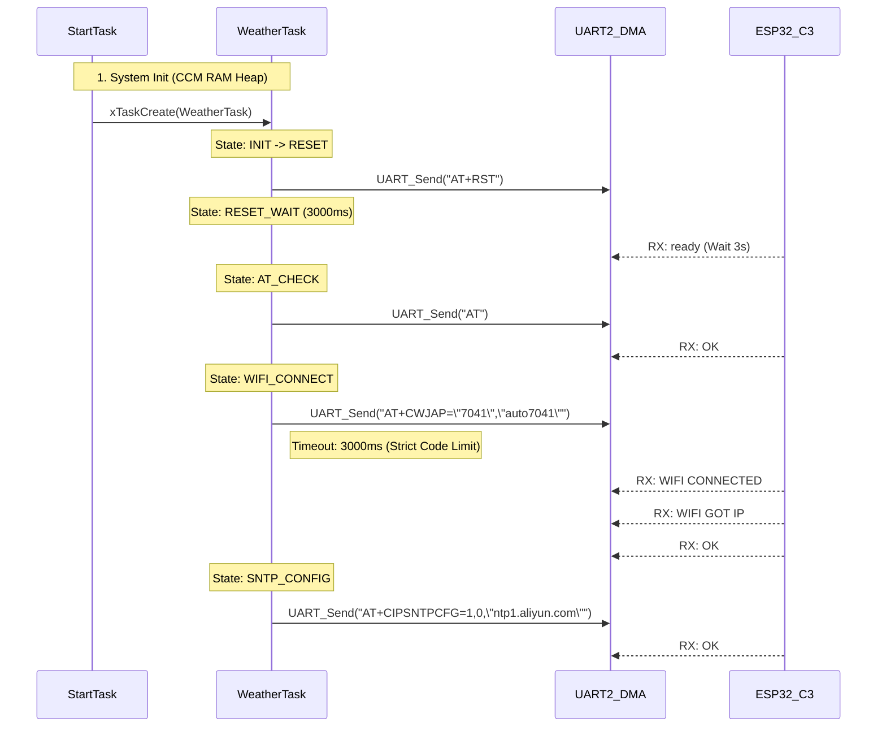
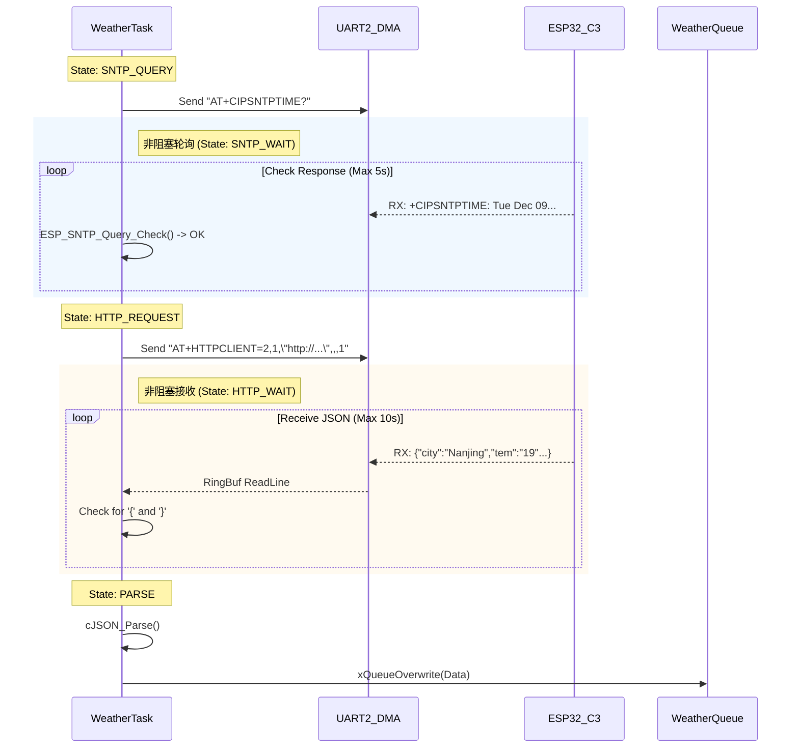
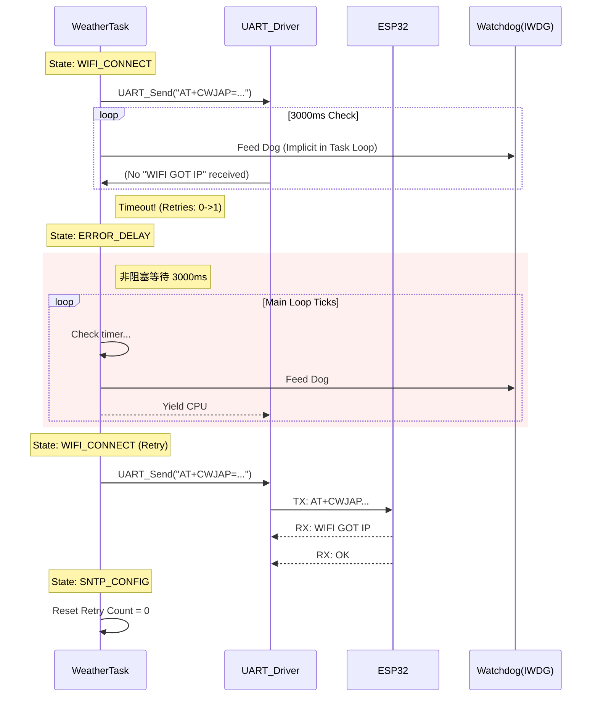
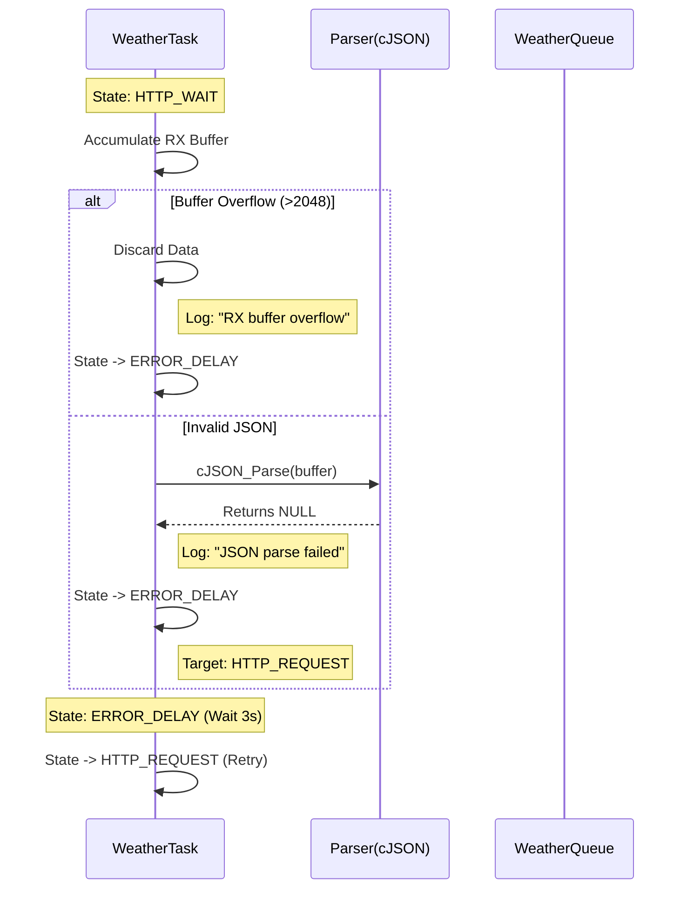

## 通信协议与交互时序文档 (Communication Protocol & Sequence)

### 1. 文档概述
- **项目名称**：天气时钟 (Weather Clock)
- **文档版本**：v1.1
- **编写人员**：meng-ming
- **编写日期**：2025-12-09
- **目的**：本文档详细定义了 STM32 主控与 ESP32 通信模组之间的 AT 指令交互协议，以及系统内部各 RTOS 任务之间的时序交互逻辑。所有参数均严格提取自当前工程源码。

### 2. 物理层与链路层 (Physical & Link Layer)
#### 2.1 模组通信接口 (STM32 <-> ESP32)
采用 UART (异步串口) 进行全双工通信。

| 参数    | 规格                      | 代码来源 / 说明                  |
|---------|---------------------------|----------------------------------|
| 端口    | UART2                     | uart_handle_variable.c: g_esp_uart_handler |
| 引脚    | PA2 (TX), PA3 (RX)        | uart_handle_variable.c: GPIO_Pin_2, GPIO_Pin_3 |
| 波特率  | 115200 bps                | uart_handle_variable.c: init.BaudRate = 115200 |
| 数据格式| 8N1                       | 8 Data Bits, 1 Stop Bit, No Parity |
| 流控    | None                      | USART_HardwareFlowControl_None |
| 接收 DMA| DMA1_Stream5 / CH4        | uart_handle_variable.c: DMA1_Stream5, DMA_Channel_4 |
| 缓冲机制| RingBuffer + IDLE中断     | uart_driver.c: 不定长数据接收    |

#### 2.2 屏幕显示接口 (STM32 <-> ST7789)
采用 SPI (串行外设接口) 进行单向高速传输。

| 参数    | 规格                      | 代码来源 / 说明                  |
|---------|---------------------------|----------------------------------|
| 端口    | SPI2                      | st7789.h: SPI2                   |
| STM32引脚    | PB10 (SCK)<br>PC3 (MOSI)<br> PC4(CS)<br>PC5(DC)<br>PE3(RST)<br>PB15(BL)     | st7789.h:<br> GPIO_Pin_10, GPIO_Pin_3 |
| 时钟频率| 21 MHz                    | st7789.c: SPI_BaudRatePrescaler_2 (42MHz/2) |
| 传输模式| DMA1_Stream4 / CH0        | st7789.h: LCD_DMA_STREAM, LCD_DMA_CHANNEL |
| 数据位宽| 8-bit                     | st7789.c: SPI_DataSize_8b (DMA传输时可能拆分) |
| 像素格式| RGB565                    | 16-bit per pixel                 |

#### 2.3 温湿度传感器接口 (STM32 <-> AHT20)
采用 GPIO 模拟 I2C (软件 I2C) 进行双向通信，确保时序稳定性和移植性。

| 参数 | 规格 | 代码来源 / 说明 |
| :--- | :--- | :--- |
| 端口 | 软件模拟 (Soft I2C) | AHT20.c: GPIOB |
| STM32引脚 | PB6 (SCL)<br>PB7 (SDA) | AHT20.c:<br>GPIO_Pin_6, GPIO_Pin_7 |
| 时钟频率 | ~50 kHz | AHT20.c: I2C_Delay (10us 半周期) |
| I2C 地址 | 0x38 (7-bit) | AHT20.c: AHT20_ADDRESS (0x70 Write) |
| 传输模式 | Polling (阻塞式轮询) | AHT20_Read_Data (含 80ms 转换等待) |
| 数据格式| 6 Bytes Raw Data | Status(8) + Humidity(20) + Temp(20) |

### 3. 应用层通信协议 (AT Commands)
STM32 作为主机 (Master)，ESP32 作为从机 (Slave)。所有指令以 \r\n 结尾。

#### 3.1 核心指令集与参数 (严格对应代码)

| 功能         | 指令 (TX)                          | 关键参数/响应                  | 超时 (ms) | 对应代码位置                  |
|--------------|------------------------------------|--------------------------------|-----------|-------------------------------|
| 复位模组     | AT+RST                             | -                   | -      | app_weather.c: WEATHER_STATE_RESET_WAIT |
| 握手检查     | AT                                 | Resp: OK                       | 1000      | app_weather.c: ESP_Send_AT     |
| 关闭回显     | ATE0                               | Resp: OK                       | 1000      | app_weather.c: WEATHER_STATE_AT_CHECK |
| 连接 WiFi    | AT+CWJAP="7041","auto7041"         | SSID: 7041 PWD: auto7041       | 3000      | esp32_module.c: ESP_WiFi_Connect(..., 3) |
| 配置 SNTP    | AT+CIPSNTPCFG=1,0,"ntp1.aliyun.com"| Timezone: 0 Server: aliyun     | 1000      | esp32_module.c: ESP_SNTP_Config |
| 查询时间     | AT+CIPSNTPTIME?                    | Resp: +CIPSNTPTIME:            |    -    | esp32_module.c: ESP_SNTP_Query_Start |
| 获取天气     | AT+HTTPCLIENT=2,1,"http://...",,,1 | URL 详见下方                   | 10000     | esp32_module.c: WEATHER_CONFIG_HTTP_TIMEOUT_MS |

#### 3.2 HTTP 请求 URL 结构
源码位置: app_weather.c -> weather_send_http_request()

```
// 格式化字符串
"http://%s/free/day?appid=%s&appsecret=%s&unescape=1&cityid=%s"

// 实际参数 (来自 app_data.h)
// Host: v1.yiketianqi.com
// AppID: 91768283
// Secret: b68BdGrM
// CityID: 动态获取 (默认 101010100 北京)
```
### 3.3 数据安全与配置
敏感信息配置位置：Constants/inc/app_data.h

为确保系统安全性，所有敏感凭证（如 WiFi 连接信息和 API 密钥）均通过宏定义进行配置。以下为示例配置，用户需根据实际需求替换占位符：

- **WiFi 凭证**：
  ```c
  #define WIFI_SSID  "YOUR_SSID"      // 请在此处修改为实际 SSID
  #define WIFI_PWD   "YOUR_PASSWORD"  // 请在此处修改为实际密码
  ```

- **API 密钥**：
  ```c
  #define WEATHER_APPID     "********"  // 请替换为实际 App ID
  #define WEATHER_APPSECRET "********"  // 请替换为实际 App Secret
  ```

**安全设计注意事项**：代码采用 snprintf 函数动态拼接 URL，避免在 Flash 中明文存储完整请求字符串，从而降低潜在泄露风险。

### 3.4 城市切换接口
**接口定义**：`APP_Weather_Set_City(const char* city_name)`

**执行逻辑**：
1. 更改 CITY_NAME 宏定义。
2. 查询 Flash 中的城市代码表，获取对应城市 ID。
3. 更新全局变量以应用新城市配置。
4. 触发天气状态机跳转至 HTTP_REQUEST 状态，立即刷新数据。

此接口确保城市切换过程高效且无缝集成于系统流程中，支持实时响应用户操作。

### 4. 交互时序图 (Interaction Sequence)
#### 4.1 系统启动与网络初始化 (Startup Phase)



#### 4.2 时间同步与天气更新 (Update Phase)


#### 4.3 异常分支：WiFi 连接失败与重试 (Failure & Retry)
在网络不稳定场景下，系统采用“检测-延时-重试”机制，确保最小化资源消耗并维持系统稳定性。以下时序图展示重试逻辑：



此机制限制最大重试次数（默认为 3 次），超出后进入 IDLE 状态，防止资源浪费。

#### 4.4 异常分支：HTTP 数据解析失败
当接收到无效或截断的 JSON 数据时，系统触发解析校验并重试。以下时序图展示完整处理流程：



校验逻辑要求 JSON 至少包含 city、wea 和 tem 字段，失败后立即重试以确保数据完整性。
### 5. 任务间通信机制 (IPC Details)
| 对象名称              | 类型              | 句柄变量          | 深度/大小     | 用途                                      |
|-----------------------|-------------------|-------------------|---------------|-------------------------------------------|
| g_weather_queue       | Queue             | QueueHandle_t     | 1 (Overwrite) | app_weather.c -> app_ui.c 传递 APP_Weather_Data_t |
| g_event_alive       | EventGroup             | EventGroupHandle_t     | - | 查看对应任务是否存活 |
| g_mutex_lcd           | Mutex             | SemaphoreHandle_t | Recursive     | 保护 SPI2 总线，防止 UI 任务与 Log/Calendar 任务冲突 |
| g_mutex_log           | Mutex             | SemaphoreHandle_t | Recursive     | 防止调试串口打印冲突 |
| g_esp_uart_handler    | Struct            | UART_Handler_t    | -    | 串口2 接收环形缓冲区                      |
| g_debug_uart_handler    | Struct            | UART_Handler_t    | -    | 代码调试
### 6. 错误码与诊断指南 (Troubleshooting)
本节提供常见异常的诊断与排查指南，便于开发与维护。所有错误码基于实际日志输出设计，支持快速定位。

#### 6.1 常见 AT 错误码映射
以下表格汇总常见错误场景、潜在原因及解决方案，基于代码日志系统（LOG_E/W/I）提取。

| 现象 / Log              | 可能原因                                      | 解决方案                                                                 |
|-------------------------|-----------------------------------------------|--------------------------------------------------------------------------|
| AT Check Failed         | 1. 串口线松动<br>2. 模组波特率非 115200      | 检查硬件连线；单独用 USB 转 TTL 测试模组。                               |
| WiFi connect failed     | 1. SSID/密码错误<br>2. 信号太弱<br>3. 仅支持 2.4G WiFi | 检查 app_data.h 配置；确保使用 2.4G 频段。                               |
| SNTP Timeout            | 1. 外网不通<br>2. 阿里云 NTP 端口被封         | 尝试更换 NTP 服务器地址 (如 pool.ntp.org)。                             |
| HTTP send failed        | 1. URL 拼接超长<br>2. 域名解析失败 (DNS)     | 检查 app_weather.c 中 URL 缓冲区大小；检查网络。                         |
| RX buffer overflow      | 1. API 返回数据过大 (>2KB)<br>2. 串口接收逻辑未及时取出 | 增大 WEATHER_CONFIG_RX_BUF_SIZE；检查 Task 调度优先级。                  |

#### 6.2 UART RingBuffer 策略
- **机制**：uart_driver.c 中维护 head 和 tail 指针，实现循环缓冲。
- **溢出保护**：当 (head + 1) % SIZE == tail 时，新字节会被直接丢弃，避免覆盖旧数据。
- **读取策略**：app_weather.c 采用“行读取”或“块读取”，配合 strstr 查找关键回复（如 OK, ERROR），确保高效解析。

#### 6.3 Watchdog (IWDG) 影响
- **喂狗位置**：app_task.c 中的 Daemon_Task 负责周期性喂狗。
- **触发复位条件**：若 Weather_Task 卡在 while 死循环中（如错误的阻塞延时），导致无法设置 EventGroup 标志位，Daemon 任务将停止喂狗，系统在 ~8s 后自动复位。
- **设计规避**：全流程采用非阻塞状态机，确保 Weather 任务始终能让出 CPU，避免饿死看门狗。